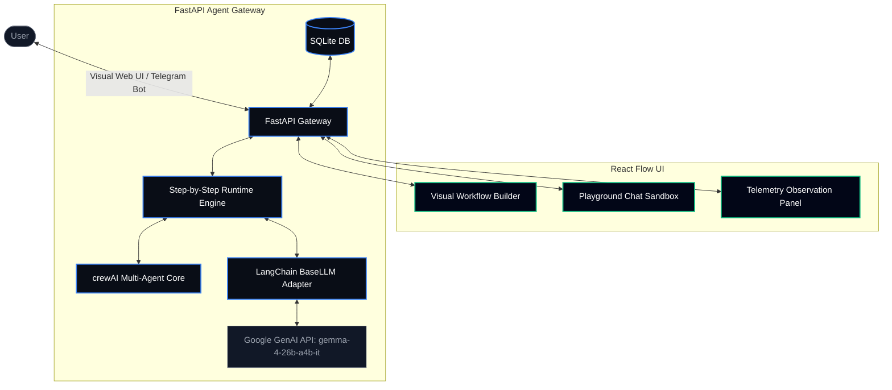
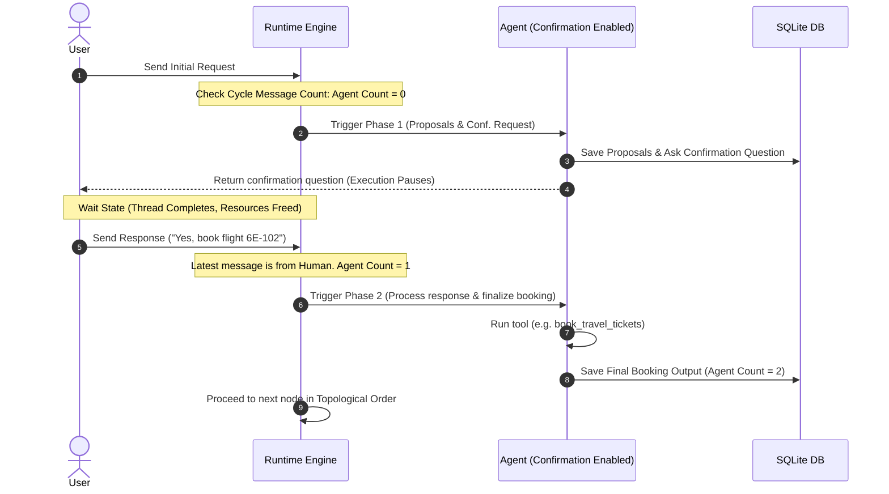

# AI Agent Orchestration Platform 🤖⛓️

Welcome to the **AI Agent Orchestration Platform**, a production-grade multi-agent orchestration solution built as an engineering evaluation showcase. 

This platform enables users to visually create, configure, and connect autonomous AI agents into collaborative workflows. The system leverages **crewAI** as the core agent execution runtime, **FastAPI** as the high-throughput backend gateway, **React & React Flow** for the visual-builder user interface, **SQLite** for relational persistence, and **Telegram** as an external messaging channel.

---

## 📌 Architecture & Design Patterns

The platform is designed around a clean separation of concerns, ensuring modularity, ease of testing, and scalability:



### 1. Presentation Layer (Frontend React Client)
* **Visual Canvas (`WorkflowBuilder.jsx`)**: Built on top of `React Flow`. It provides drag-and-drop node initialization, dynamic edge connection representing step dependencies, node selection for internal overrides, and pre-seeded templates.
* **Floating Execution Tracing**: Captures real-time Server-Sent Events (SSE) from the backend to display step outputs, active status indicators, and pause states.
* **Telemetry Observation Grid**: Provides live summaries of execution times, token usage, cost metrics, and full logs of agent internal dialogues.

### 2. Application Layer (FastAPI API Gateway)
* **CRUD Endpoints (`routers/agents.py`)**: Manage agent configurations and workflows using SQLAlchemy ORM.
* **Real-time Event Stream (SSE)**: Formulates a streaming response generator via FastAPI's `StreamingResponse`, yielding agent outputs as they are generated.
* **Persistent History Logger**: Persists conversation message threads (`models.Message`) so both UI sandbox sessions and Telegram interactions stay synchronized.

### 3. Agent Runtime Layer (crewAI & Adapter)
* **Agent Initialization (`runtime.py`)**: Spawns crewAI agent instances from database models, injecting their backstories with configured skills, interaction rules, and guardrails to ensure compliance.
* **Adapter Pattern (`LangChainBaseLLM`)**: Adapts crewAI's custom `BaseLLM` interface to wrap LangChain's `ChatGoogleGenerativeAI`. This resolves Pydantic validation mismatches and ensures compatibility with strict developer API requirements (model restricted to `gemma-4-26b-a4b-it`).
* **Tool Bindings**: Connects agents to executable python tools (web search scraper, itinerary schedulers, and calendar link publishers).
* **Backstory Adaptation**: Automatically adapts the backstory of travel agents when mapped to other domains (e.g. recruitment/scheduling) by appending a dynamic override prompt instructing the model how to reuse travel tools for new tasks.

### 4. Integration Layer (Telegram Bot)
* **Background Daemon (`telegram_bot.py`)**: A background polling loop client listening for incoming chat updates.
* **Context Routing**: Intercepts Telegram queries, checks for the active database workflow, and routes inputs through the step-by-step executor.

---

## 💾 Relational Persistence (SQLite DB Schema)

The SQLite database (`agent_orc_platform.db`) maintains all configurations, logs, and workflow states. The mapping is managed via SQLAlchemy ORM in [models.py](file:///Users/abhishek/Developer/agent-orchestrator/models.py):

| Table Name | Model Class | Description |
| :--- | :--- | :--- |
| `agents` | `Agent` | Stores agent metadata: `name`, `role`, `system_prompt`, `goal`, target `model`, `max_tokens`, enabled `tools`, and `channels`. |
| `agent_configs` | `AgentConfig` | Houses flexible options like `schedules`, `memory` switches, `skills` arrays, `interaction_rules`, and `guardrails`. |
| `messages` | `Message` | Stores conversational logs partitioned by `thread_id`. Tracks `sender_type` (`human`, `agent`, `system`) and content. |
| `telemetry_logs`| `TelemetryLog` | Captures metrics for executions: elapsed duration, input/output tokens, cost, and raw captured `terminal_log`. |
| `workflows` | `Workflow` | Persists visual builder configurations with `nodes` and `edges` JSON blocks, and `is_active_telegram` markers. |

---

## ⚡ Step-by-Step Execution Engine & Cycles

Instead of launching the entire multi-agent team simultaneously (which leads to concurrency conflicts, blocking threads, and makes human-in-the-loop validation impossible on the web), the platform compiles the node canvas into a sequential pipeline.

### 1. Topological Sorting & Kahn's Algorithm
The backend runtime uses Kahn's algorithm in `topological_sort` to sort the visual React Flow nodes based on the connections (edges). This guarantees that dependent steps (e.g. ticket booking) always wait for prerequisites (e.g. flight searches) to finish first.

### 2. Workflow Cycle Boundaries
To run workflows repeatedly in the same chat thread, the system isolates runs using system boundary messages:
* When a workflow run finishes executing all nodes, the backend appends a special system boundary message: `"--- workflow_cycle_boundary ---"`.
* The next prompt from the user starts a fresh cycle. The runtime only reads and counts messages created *after* the latest cycle boundary.

### 3. Stateless Human-in-the-Loop Engine
The confirmation mechanism is managed statelessly by evaluating agent message counts within the current execution cycle:



* **Phase 1 (Agent Message Count = 0)**:
  * When execution reaches a node with `requireConfirmation` enabled, the agent is instructed to detail its proposals and ask the user to confirm their selection.
  * The agent saves this question to the database and the workflow **pauses** execution, returning the question to the client.
* **Wait State**:
  * The execution thread completes. The user reviews the question on their chat client (Web or Telegram).
* **Phase 2 (Agent Message Count = 1)**:
  * The user sends their response (e.g. *"Confirm flight 6E-829, my name is Abhishek"*), inserting a new human message.
  * The runner detects that the latest message in the thread is from a human.
  * The agent runs again, instructed that the user has provided the details. It processes the response, finalizes the booking, and **continues** automatically to the next node.
* **Skipped (Agent Message Count >= 2)**:
  * If the agent has already executed both phases, it is skipped.

---

## 🛠️ Custom Python Tools

The platform provides 5 custom python tools, declared in [runtime.py](file:///Users/abhishek/Developer/agent-orchestrator/runtime.py) and registered in `AVAILABLE_TOOLS`:

1. **`get_current_time(timezone)`**: Returns the current ISO-formatted time for the requested timezone.
2. **`search_travel_options(origin, destination, travel_date)`**: Fetches web search snippets via DuckDuckGo HTML scraping. It then invokes Gemini (`gemma-4-26b-a4b-it`) to synthesize flight options, prices, and flight codes, falling back to a dynamic mock generator if APIs are unreachable.
3. **`book_travel_tickets(option_id, traveler_name)`**: Confirms a reservation based on the provided Option ID and returns a confirmed booking reference (`TX-XXXXXX`).
4. **`add_to_calendar_and_itinerary(booking_id, itinerary_details)`**: Creates a structured day-by-day itinerary and schedules it on the database-simulated calendar.
5. **`add_google_calendar_event(summary, start_time, end_time, description)`**: Formulates a direct Google Calendar template URL (`https://calendar.google.com/calendar/render?action=TEMPLATE...`), providing the user with a clickable markdown link to save the event instantly to their calendar.

---

## 📈 Live Telemetry & Cost Estimations

Every execution records metrics in the `TelemetryLog` table:
* **Terminal stdout Redirection**: Standard output (`sys.stdout`) is intercepted using `io.StringIO()` during `crew.kickoff()`. ANSI color escape sequences are stripped via regex `\x1B(?:[@-Z\\-_]|\[[0-?]*[ -/]*[@-~])` to format cleaner agent dialogue logs directly on the web UI panel.
* **Token & Heuristic Cost Tracking**: 
  * Prompt and response tokens are estimated heuristically based on input character length:
    * `input_tokens = int(text_length * 0.4)`
    * `output_tokens = int(text_length * 0.3)`
  * Costs in USD are calculated using standard Gemini developer rates:
    * **Input Rate**: $0.075 per 1,000,000 tokens
    * **Output Rate**: $0.30 per 1,000,000 tokens
    * `estimated_cost = (input_tokens / 1,000,000 * 0.075) + (output_tokens / 1,000,000 * 0.30)`

---

## ⚙️ Quick Start Setup

You can run this platform fully locally either using **Docker Compose** (recommended for a one-command launch) or directly via python/node commands.

### 1. Prerequisites & Environment Setup
Regardless of the running method, configure your `.env` file in the root directory:
```env
# .env
GOOGLE_API_KEY="your-provided-gemini-key"

# Optional: To enable the Telegram message channel integration
TELEGRAM_BOT_TOKEN="your-telegram-bot-token"
TELEGRAM_ALLOWED_USERNAMES="username1,username2" # Optional: Whitelisted users
```

---

### 🐳 Method A: Docker Compose (One-Command Setup)
Launch the entire platform (backend, frontend, and Telegram bot) in one go:
```bash
docker compose up --build
```
*   **Web UI**: Open [http://localhost:5173](http://localhost:5173) in your browser.
*   **API Documentation**: Reachable at [http://localhost:8000/docs](http://localhost:8000/docs).
*   **Data Persistence**: The SQLite file `agent_orc_platform.db` is volume-mounted and preserved on the host.
*   **Development Hot-Reload**: Local volume mapping (`. -> /app` and `./frontend -> /app`) combined with Vite watch polling and FastAPI `--reload` ensures that any host code edits instantly update inside the running containers.

---

### 🐍 Method B: Standard Local Development Run

#### 1. Install Python Backend Dependencies
Ensure you are using **Python 3.10+**. Activate your virtual environment and run:
```bash
pip install -r requirements.txt
```

#### 2. Launch Backend & Telegram Bot
Start the FastAPI server:
```bash
uvicorn main:app --reload
```
*Note: If `TELEGRAM_BOT_TOKEN` is found in `.env`, the Telegram Bot thread starts automatically!*

#### 3. Launch Frontend Visual Web UI
Navigate to the frontend folder, install dependencies, and run:
```bash
cd frontend
npm install
npm run dev
```
Open [http://localhost:5173](http://localhost:5173) in your browser.

---

## 🛠️ Adding New Workflows & Channels

### How to Add a New Pre-built Template
1. Open [WorkflowBuilder.jsx](file:///Users/abhishek/Developer/agent-orchestrator/frontend/src/WorkflowBuilder.jsx).
2. Inside `loadTemplate` method, add a new branch corresponding to your template name.
3. Query the desired agents from `availableAgents` and construct their React Flow node coordinates (e.g. `position: { x: ..., y: ... }`) and edges.
4. Add a button in the sidebar panel to trigger it.

### How to Add a New Messaging Channel (e.g. Slack/WhatsApp)
1. Implement a polling loop or webhook route in a new file (e.g. `slack_bot.py`), following the structure of `telegram_bot.py`.
2. Link the received message to `execute_workflow_step_by_step` from [runtime.py](file:///Users/abhishek/Developer/agent-orchestrator/runtime.py) for conversational execution.
3. Persist the human and agent response in the database using the same `models.Message` schema.
4. Register the bot startup in `main.py` inside the `@app.on_event("startup")` handler.