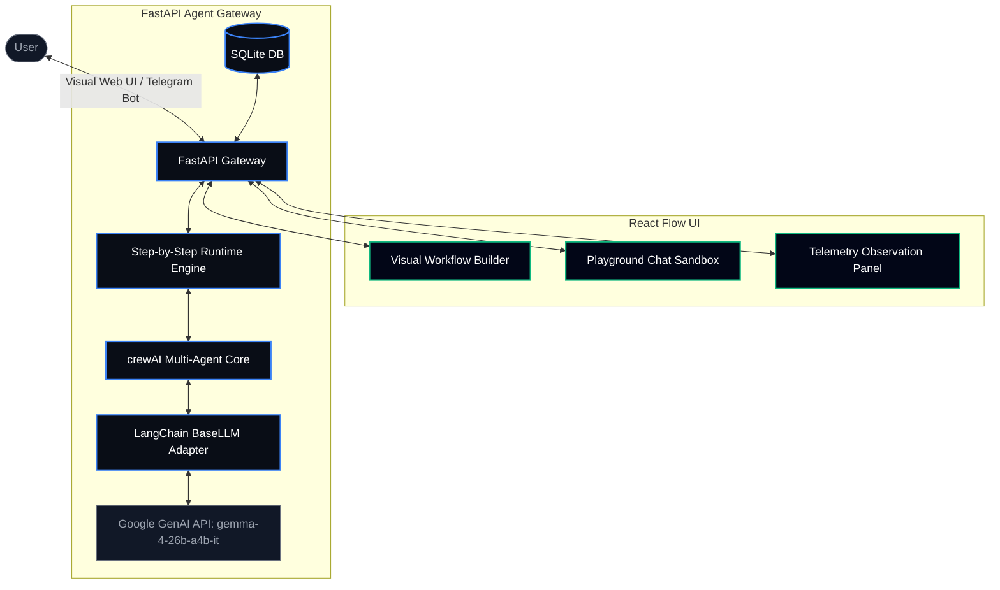

# AI Agent Orchestration Platform 🤖⛓️

Welcome to the **AI Agent Orchestration Platform**, a production-grade multi-agent orchestration solution built as an engineering evaluation showcase. 

This platform enables users to visually create, configure, and connect autonomous AI agents into collaborative workflows. The system leverages **crewAI** as the core agent execution runtime, **FastAPI** as the high-throughput backend gateway, **React & React Flow** for the visual-builder user interface, **SQLite** for relational persistence, and **Telegram** as an external messaging channel.

---

## 📌 Architecture & Design Patterns

The platform is designed around a clean separation of concerns, ensuring modularity, ease of testing, and scalability:



### 1. Presentation Layer (Frontend React Client)
* **Visual Canvas (`WorkflowBuilder.jsx`)**: Built on top of `React Flow`. It provides drag-and-drop node initialization, dynamic edge connection representing step dependencies, node selection for internal overrides, and templates pre-seeding.
* **Floating Execution Tracing**: Captures real-time Server-Sent Events (SSE) from the backend to display step outputs, active status indicators, and pause states.
* **Telemetry Observation Grid**: Provides live summaries of execution times, token usage, cost metrics, and full logs of agent internal dialogues.

### 2. Application Layer (FastAPI API Gateway)
* **CRUD Endpoints**: Manage agent configurations and workflows using SQLAlchemy ORM.
* **Real-time Event Stream (SSE)**: Formulates a streaming response generator via FastAPI's `StreamingResponse`, yielding agent outputs as they are generated.
* **Persistent History Logger**: Persists conversation message threads (`models.Message`) so both UI sandbox sessions and Telegram interactions stay synchronized.

### 3. Agent Runtime Layer (crewAI & Adapter)
* **Agent Initialization**: Spawns crewAI agent instances from database models, injecting their backstories with configured skills, interaction rules, and guardrails to ensure compliance.
* **Adapter Pattern (`LangChainBaseLLM`)**: Adapts crewAI's custom `BaseLLM` interface to wrap LangChain's `ChatGoogleGenerativeAI`. This resolves Pydantic validation mismatches and ensures compatibility with strict developer API requirements (model restricted to `gemma-4-26b-a4b-it`).
* **Tool Bindings**: Connects agents to executable python tools (web search scraper, itinerary schedulers, and calendar link publishers).

### 4. Integration Layer (Telegram Bot)
* **Background Daemon**: A background polling loop client listening for incoming chat updates.
* **Context Routing**: Intercepts Telegram queries, checks for the active database workflow, and routes inputs through the step-by-step executor.

---

## 🛠️ Technical Decisions & Tradeoffs

During development, we evaluated several technical architectures and frameworks. Below is the justification for our library and package choices, directly addressing performance, complexity, and local delivery constraints:

### 1. Agent Framework: crewAI vs. LangGraph vs. AutoGen
*   **Why crewAI?**
    *   **Abstraction and Role-playing**: crewAI is explicitly optimized for role-play orchestration. It provides first-class properties for `backstory`, `goal`, and `role`, making it easy to map database-seeded agents into fully realized LLM personas.
    *   **Time-to-Workflow Efficiency**: Unlike **LangGraph** (which is a low-level state-chart framework requiring manual state reducer, node, and edge wiring in Python code), crewAI allows us to dynamically compile and run a sequential crew of agents from database templates in a few lines of code. This dramatically reduced the *time from zero to a working multi-agent workflow*.
    *   **Structured Sequencing**: Unlike **AutoGen** (which is highly chat-centric and prone to conversational loops/hallucinations), crewAI's sequential process makes it easy to enforce strict execution boundaries (e.g. Travel Searching ➡️ Booking ➡️ Scheduling), which is crucial for deterministic business workflows.

### 2. Backend Gateway: FastAPI
*   **Asynchronous Support**: FastAPI natively supports asynchronous execution (via Starlette and pydantic), enabling the background Telegram bot thread and FastAPI web endpoints to share resources concurrently without blocking requests.
*   **Real-time Event Streaming**: FastAPI provides `StreamingResponse` out of the box. This allowed us to build a Server-Sent Events (SSE) gateway that streams live agent terminal logs and step-by-step outputs to the UI, assuring the user that the background execution is active.

### 3. Visual Layer: React Flow
*   **Canvas Orchestration**: React Flow is the industry-standard visual node rendering library. It handles infinite canvas pan/zoom, coordinate positioning, node drop events, and dynamic animated edge lines out of the box, avoiding the need to write custom HTML canvas rendering logic.

### 4. Database & ORM: SQLite + SQLAlchemy
*   **Zero-Dependency Local Run**: Relational mapping through SQLAlchemy allows us to represent the multi-agent graph (agents, configs, message threads, telemetry) cleanly. SQLite requires no background service setups (like PostgreSQL or MySQL), maintaining the constraint that the project must run fully locally out of the box.

### 5. Web Search Agent Tool: DuckDuckGo Scraping (via beautifulsoup4)
*   **Zero-Cost Flight Search**: Using free DuckDuckGo HTML scraping combined with Gemini synthesis allows the search agents to execute real-time flight search lookups on live web pages without incurring Google Search API costs or requiring subscription-based search engine keys.

---

## ⚡ Key Observable Implementations

### 1. Stateless Human-in-the-Loop Engine
Rather than using blocking console inputs (which freeze threads and break web application concurrency), the platform handles pauses and resumptions statelessly by reading the database message history:

* **Phase 1 (First execution, Agent Message Count = 0)**:
  * When execution reaches a node with `requireConfirmation` enabled, the agent is instructed to detail its proposals (e.g. flight options) and ask the user to confirm their details.
  * The agent saves this question to the database and the workflow **pauses** execution, returning the question to the client.
* **Wait State**:
  * The execution thread completes, freeing up resources. The user reviews the question on their chat client.
* **Phase 2 (Resume execution, Agent Message Count = 1)**:
  * The user sends their response (e.g. *"Confirm flight 6E-829, my name is Abhishek"*), inserting a new human message.
  * The runner detects that the latest message in the thread is from a human.
  * The agent runs again, instructed that the user has provided the details. It processes the response, finalizes the booking, and **continues** automatically to the next node.

### 2. Live Telemetry & Compute Cost Calculator
Every execution gathers metadata stored in the database:
* **Token Tracking**: Computes prompt and response tokens.
* **Cost Ingestion**: Dynamically calculates API costs in USD based on standard rates ($0.075 per 1M input tokens, $0.30 per 1M output tokens).
* **observability logs**: Standard output streams (`sys.stdout`) are intercepted during crewAI tasks execution. ANSI color escapes are stripped, formatting the inner agent dialogue and tool calls directly onto the web UI logs panel.

---

## ⚙️ Quick Start Setup

You can run this platform fully locally either using **Docker Compose** (recommended for a one-command launch) or directly via python/node commands.

### 1. Prerequisites & Environment Setup
Regardless of the running method, configure your `.env` file in the root directory:
```env
# .env
GOOGLE_API_KEY="your-provided-gemini-key"

# Optional: To enable the Telegram message channel integration
TELEGRAM_BOT_TOKEN="your-telegram-bot-token"
```

---

### 🐳 Method A: Docker Compose (One-Command Setup)
Launch the entire platform (backend, frontend, and Telegram bot) in one go:
```bash
docker compose up --build
```
*   **Web UI**: Open [http://localhost:5173](http://localhost:5173) in your browser.
*   **API Documentation**: Reachable at [http://localhost:8000/docs](http://localhost:8000/docs).
*   **Data Persistence**: The SQLite file `agent_orc_platform.db` is volume-mounted and preserved on the host.
*   **Development Hot-Reload**: Local volume mapping (`. -> /app` and `./frontend -> /app`) combined with Vite watch polling and FastAPI `--reload` ensures that any host code edits instantly update inside the running containers.

---

### 🐍 Method B: Standard Local Development Run

#### 1. Install Python Backend Dependencies
Ensure you are using **Python 3.10+**. Activate your virtual environment and run:
```bash
pip install -r requirements.txt
```

#### 2. Launch Backend & Telegram Bot
Start the FastAPI server:
```bash
uvicorn main:app --reload
```
*Note: If `TELEGRAM_BOT_TOKEN` is found in `.env`, the Telegram Bot thread starts automatically!*

#### 3. Launch Frontend Visual Web UI
Navigate to the frontend folder, install dependencies, and run:
```bash
cd frontend
npm install
npm run dev
```
Open [http://localhost:5173](http://localhost:5173) in your browser.

---

## 🛠️ Adding New Workflows & Channels

### How to Add a New Pre-built Template
1. Open [WorkflowBuilder.jsx](file:///Users/abhishek/Developer/agent-orchestrator/frontend/src/WorkflowBuilder.jsx).
2. Inside `loadTemplate` method, add a new branch corresponding to your template name.
3. Query the desired agents from `availableAgents` and construct their React Flow node coordinates (e.g. `position: { x: ..., y: ... }`) and edges.
4. Add a button in the sidebar panel to trigger it.

### How to Add a New Messaging Channel (e.g. Slack/WhatsApp)
1. Implement a polling loop or webhook route in a new file (e.g. `slack_bot.py`), following the structure of `telegram_bot.py`.
2. Link the received message to `execute_crewai_chat` from [runtime.py](file:///Users/abhishek/Developer/agent-orchestrator/runtime.py) for conversational execution.
3. Persist the human and agent response in the database using the same `models.Message` schema.
4. Register the bot startup in `main.py` inside the `@app.on_event("startup")` handler.